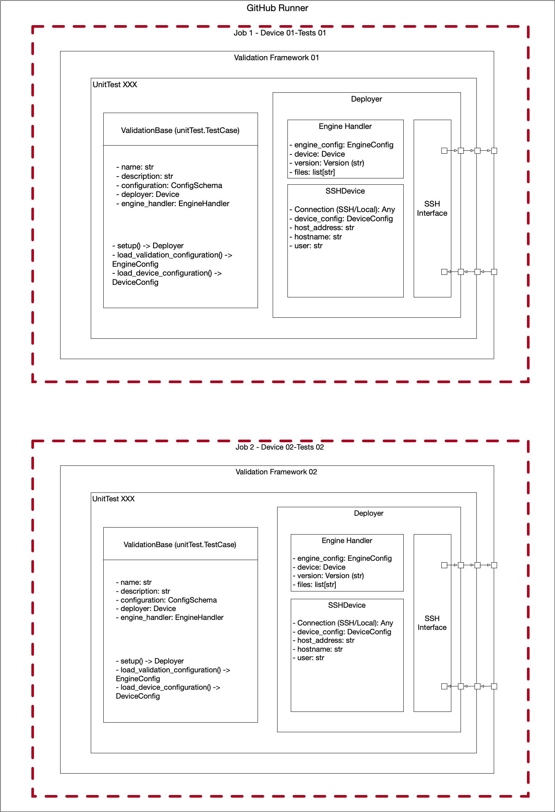

# NuvlaEdge validation architecture overview

The validation system aims to provide a base automated way of testing overall
functionalities of the NuvlaEdge software. It builds a standard validation
system based on Nuvla requirements and QoS promised by SixSq.

The validation system is composed by two main components: Validation Framework
and TestBed.

**TestBed**: Cluster of devices on which the validation is run.

**Validation Framework**: A collection of microservices triggered by GitHub
actions. When triggered, it will create a validation process per configured
device and run a set of tests on that device. 

# Validation Framework design

The validation framework implements a generic platform to perform validation
tests over the NuvlaEdge software.

The framework consists in three main components:

1. Base framework
2. Validation tests
3. GitHub action runners



## 1. Base Framework

The base framework extends Python UnitTests providing a parent class that must
be used for sub-classing by the actual validation test implementation. This
class comes with a subset of tools:

- Remote device handler: TargetDevice
- NuvlaEdge release handler: ReleaseHandler
- Nuvla client interface: NuvlaClient

### TargetDevice

This tool provides an interface to run remote commands in the configured device.

### ReleaseHandler

Currently, implemented for standard releases on `nuvlaedge/deployment` repo.
Controls the release to be tested. Checks and triggers the download of the
remote required files.

### NuvlaClient

Interfaces the creation and removal of the Edges to be tested on Nuvla service.
Also allows for configurations on different edge starts.

## 2. Validation Tests

The actual test implementations. It always extends the ValidationBase class and
have to be decorated with @validator tag and a unique name. This notation allows
the system to recognize it as a test and include it in the set of tests to be run.

## 3. GitHub Actions Runner

A custom GitHub runner with an updated version of the framework and the
preconfigured devices that runs one battery of tests at a time in all the
available devices. Available devices are those which configuration is stored in
the default folder and are online (will be checked automatically).

## 4. The validation framework package

```shell
validation_framework --help

usage: __main__.py [-h] [--target TARGET] [--validator VALIDATOR] [--release RELEASE] [--repository REPOSITORY] [--branch BRANCH]

options:
  -h, --help                show this help message and exit
  --target TARGET           target device configuration file (e.g. rpi4.toml)
  --validator VALIDATOR     target validation set (e.g. basic_tests)
  --release RELEASE         target base release (e.g '2.4.6') to use as base
  --repository REPOSITORY   target repository to validate when writting code in a NuvlaEdge component
  --branch BRANCH           target branch to validate when writting code in a NuvlaEdge component

```
# Testbed

TODO.