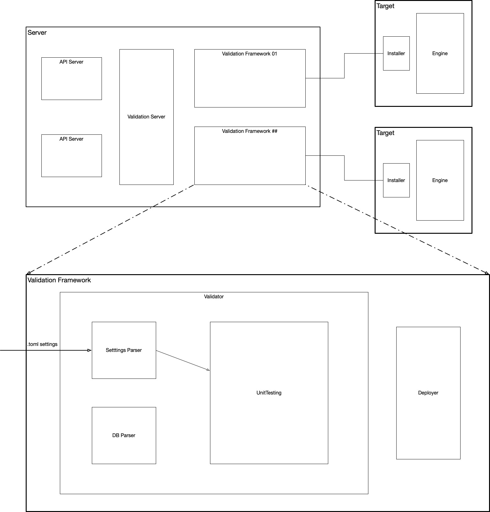

# Validation Framework

The validation framework implements a generic platform to perform validation tests over the NuvlaEdge software.

The framework consists in two main components: 

- Base framework
- Validation tests
- GitHub action runners

## 1. Base Framework
The first extends Python UnitTests providing a parent class which can easily be extended. This service comes with a 
subset of tools:

- Remote device handler: TargetDevice
- NuvlaEdge release handler: ReleaseHandler
- Nuvla client interface: NuvlaClient

### TargetDevice
This tool provides an interface to run remote commands in the configured device.

### ReleaseHandler
Currently implemented for Standard releases on nuvlaedge/deployment repo.
Controls the release to be tested. Checks and triggers the download of the remote required files

### NuvlaClient
Interfaces the creation and removal of the Edges to be tested. Also allows for 
configurations on different edge starts

## 2. Validation Tests
The actual test implementations. It always extends the ValidationBase class and have to be decorated with @validator tag and a unique name.
This notation allows the system to recognize it as a test and include it in the test battery (Corresponding folder).  

## 3. GitHub Actions Runner
A custom GitHub runner with an updated version of the framework and the preconfigured devices that runs one battery of tests at a time in all the available devices.
Available devices are those which configuration is stored in the default folder and online (will be checked automatically)

